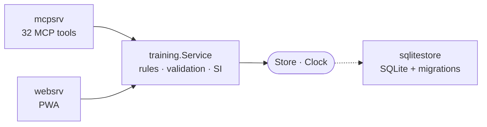

# Training MCP

[](https://github.com/FullFran/training-mcp/actions/workflows/ci.yml)
[](go.mod)
[](LICENSE)

**Log your training by talking to it.** A single-user Go service that replaces a
workout spreadsheet with 32 conversational MCP tools over Streamable HTTP,
plus an installable PWA for the gym floor. SQLite for storage, no framework,
no mock library.

```
you:  "tres por ocho en press banca a 80, RPE 8"
→ log_set  → today's session, created if needed, SI recalculated
```

## Why it is built this way

The same workout gets logged two ways — talking to ChatGPT on the sofa, tapping
a phone between sets — and both must apply **identical** rules. Same validation,
same exercise normalization, same SI arithmetic. So the rules live in one
domain package and both interfaces are adapters over it:



`training` imports no adapter. That is what makes it testable without a
database, and what makes the two front ends provably unable to disagree about
what a set is worth.

Full write-up: **[docs/architecture.md](docs/architecture.md)**.

## What is worth a look

| | |
|---|---|
| **Ports and adapters, honestly applied** | The dependency arrow only points inwards. [architecture](docs/architecture.md) |
| **`Clock` as a function type** | One method, so `time.Now` satisfies it directly. No mock framework in the repo — tests pass a closure. |
| **Prescription copying** | Starting a session from a plan copies it. Editing a template never rewrites history; adjusting today never edits the template. |
| **Totals recalculated, never incremented** | A deleted or edited set cannot leave a session total wrong. |
| **Advisory, never automatic** | `suggest_load` and `volume_recommendation` explain themselves and decline when they lack evidence. Neither ever edits a plan. |
| **Config absence removes surface** | Unset `WEB_BASE_PATH` means the PWA is not mounted at all, rather than served on a default path. |

## Quick path

1. Install Go 1.26 or newer.
2. Set `MCP_BEARER_TOKEN` and run `go run ./cmd/training-mcp` (default `:8080`).
3. Expose `/mcp` through HTTPS for a public ChatGPT connector; local tunnel-only development is documented in `docs/connection-paths.md`.
4. Verify with `go test ./...` and `go vet ./...`. CI runs the same checks on
   every push, plus `-race`, `gofmt`, a Docker build, and a 70% statement
   coverage floor on `internal/sqlitestore` — the layer that touches the data.

## Configuration

| Variable/flag | Default | Purpose |
|---|---|---|
| `--addr` | `:8080` | HTTP listen address |
| `TRAINING_DB_PATH` | `~/.local/share/training-mcp/training.db` | SQLite file |
| `MCP_BEARER_TOKEN` | required | Static bearer credential |
| `MCP_AUTH_DISABLED=1` | disabled | Unsafe tunnel-only development bypass; never use in production |
| `WEB_BASE_PATH` | empty (web UI disabled) | Secret prefix the PWA is served from, e.g. `/a1b2c3…` |

The unauthenticated `GET /health` endpoint returns `{"status":"ok"}`. MCP is only available at `/mcp` for GET, POST, and DELETE. Public ChatGPT access requires HTTPS at the TLS termination boundary.

## Tools

32 tools, grouped by what you are doing: logging sets, managing plans,
adjusting today's session, progression and analysis, the feedback loop, and the
exercise catalogue.

**Full reference: [docs/tools.md](docs/tools.md)** — every tool with the
description the model actually receives, extracted from the source so it cannot
drift, followed by the design notes explaining why the surface looks like this.

A few shapes worth knowing before reading it:

- `log_set` needs no session id. It finds or creates today's session, so
  conversational logging is one call. The explicit `start_session` + `add_set`
  path remains for when you want control.
- Load is never planned. A prescription is sets, reps and RPE; the weight that
  meets it is discovered at the gym.
- A set can carry an intensity technique (drop set, rest-pause, myo-reps). It
  is a property of the set, not a separate exercise, so volume still counts
  toward the right muscle group while a technique set never becomes the
  exercise's record.
- Every exercise maps to exactly one muscle group, so group SI is a true
  partition of session SI. Unmapped exercises are reported under an empty
  group rather than dropped, keeping catalogue gaps visible.

## Web UI (PWA)

Setting `WEB_BASE_PATH` mounts an installable PWA for logging sets from a phone
without going through ChatGPT. It is a driving adapter over the same
`training.Service`, so validation, exercise normalization and SI calculation are
shared with the MCP tools and cannot drift apart.

- Served only under the configured secret prefix; unset means not served at all.
- A plan can be started for the day; its exercises become a checklist showing
  done/target sets, and tapping one loads its prescription into the form.
- The day's plan is fully adjustable mid-session: add or drop an exercise,
  change its set count, skip it, or substitute it when a machine is taken.
  Sets already logged are never touched by any of this — an exercise removed
  from the plan simply reappears as off-plan work.
- Sets are grouped by exercise, the way a workout is performed and read back.
- The entry form shows what was done last time for that exercise and the
  standing estimated-1RM record; a set matching the record is badged `PR`.
- The exercise field autocompletes from every exercise already known, which is
  what stops the catalogue fragmenting into near-duplicate names.
- Quick-pick chips restore the last weight, reps and RPE per exercise.
- Session feedback asks only about the muscle groups actually trained that day.
- Superset members are marked in the checklist; after logging one, the next
  movement of the round loads immediately and the rest timer is held back
  until the round is finished.
- An exercise's setup note is shown whenever that exercise is selected.
- `/plans` builds and edits routines from the phone: rename, add, reorder and
  remove exercises, and write the routine's notes. It is a separate screen
  because planning is deliberate work, not something done between sets.
- A rest timer starts on every logged set and remembers the adjusted duration.
- Sets can be edited in place instead of deleted and re-entered.
- Today's session is created lazily on the first set, so opening the app never
  leaves an empty session behind.
- The service worker caches the shell and the last viewed pages for offline
  *reading*. Writes always require the network — a set only counts once stored.

`GET {base}/export.db` streams a consistent snapshot of the whole database,
taken with `VACUUM INTO` so it is safe while the server is running. The result
is a plain SQLite file: **restoring is copying it back into the data volume.**
Nothing else in this deployment keeps a second copy, so this is the backup.
`scripts/backup.sh` downloads one, verifies it opens and passes an integrity
check, and keeps the last 30 daily copies.
`scripts/install-backup-cron.sh` schedules it daily — a backup you have to
remember to take is not a backup.

**Authentication is currently the secret URL itself.** The reverse proxy injects
the bearer token, so anyone holding the URL has full access. This is tracked
debt, not a design: see the open issues.

## Scope boundary

This MVP excludes recommendations, multi-user identity/RBAC, REST/GraphQL,
OAuth/JWT/token rotation, audit history, cloud sync/backups, concurrent-writer
controls, and formula changes.

Three exclusions were deliberately lifted as the tool proved useful:
frontend/mobile clients (the PWA), analytics (per-muscle volume and exercise
progression), and planned workouts (plans). Everything else still stands.

Plans record prescriptions you decide. The volume-landmark feedback loop is
implemented as an advisory: it reports a set-count change per muscle group, but
never edits a plan on its own.

## Documentation

- [Architecture](docs/architecture.md) — ports and adapters, package layout, testing
- [MCP tool reference](docs/tools.md) — all 32 tools
- [ChatGPT setup](docs/chatgpt-setup.md)
- [Connection paths and tunnel safety](docs/connection-paths.md)
- [SI formula](docs/si-formula.md)

The external Secure MCP Tunnel smoke flow is **unverified in this repository**. Use the official provider documentation rather than invented commands.
