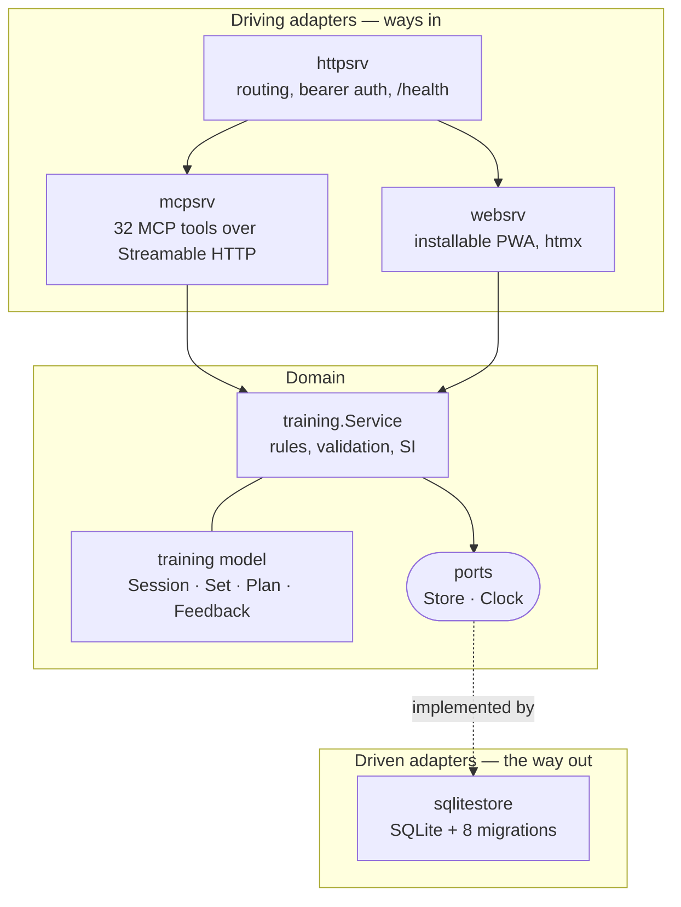

# Architecture

Training MCP is a hexagonal (ports and adapters) Go service. One domain, one
service, several ways in, one way out.

The shape exists for a concrete reason: the same workout can be logged by
talking to ChatGPT, or by tapping a phone between sets. Those are two very
different interfaces onto **identical** rules — the same validation, the same
exercise normalization, the same SI arithmetic. Duplicating that logic per
interface is how two front ends silently start disagreeing about what a set is
worth.



## The two ports

The domain declares what it needs and nothing more.

```go
// internal/training/store.go
type Store interface { /* 37 methods, all context-first */ }

// internal/training/model.go
type Clock func() time.Time
```

`Clock` being a function type rather than an interface is deliberate: it has one
method, and `time.Now` satisfies it with no adapter at all. Wiring in
`main.go` reads `training.NewService(store, time.Now)`, and a test pins the date
by passing a closure. There is no mock framework anywhere in this repository.

## Why the packages sit where they do

| Package | Role | Depends on |
|---|---|---|
| `internal/training` | Domain model, rules, SI arithmetic, ports | nothing but stdlib |
| `internal/sqlitestore` | Driven adapter: SQL, migrations, snapshots | `training` (implements `Store`) |
| `internal/mcpsrv` | Driving adapter: MCP tool surface | `training` |
| `internal/websrv` | Driving adapter: PWA, templates, static | `training` |
| `internal/httpsrv` | Composition: routing, auth, health | the adapters above |
| `internal/config` | Environment and flags | nothing |
| `cmd/training-mcp` | Wiring | everything, briefly |

The dependency arrow only ever points **inwards**. `training` imports no
adapter, which is what keeps it testable without a database and what makes the
PWA and the MCP surface provably consistent: neither can drift, because neither
owns any rules.

## What the domain refuses to delegate

Three things live in the service on purpose, because putting them in an adapter
is how they end up implemented twice, slightly differently:

- **Exercise normalization** — trimmed and lowercased on the way in, so
  `Press Banca`, `press banca ` and `press banca` are one exercise with one
  history, not three.
- **SI computation** — the descriptive `max(0, 0.2 * RPE - 0.6)` formula
  inherited from the spreadsheet this replaced. Totals are recalculated from
  stored per-set values rather than incremented, so a deleted or edited set
  cannot leave a session total wrong.
- **Prescription copying** — starting a session from a plan *copies* it. From
  then on the session owns its prescription. Editing a template never rewrites
  a past session, and adjusting today never edits the template.

## Persistence

SQLite, single file, eight forward-only migrations under
`internal/sqlitestore/migrations/`. Each numbered file is an additive step
(`001_init`, `002_exercise_groups`, … `008_plan_item_notes`), which is what lets
the schema grow without the single user ever having to reset their history.

`sqlitestore` carries the highest coverage floor in CI (70% statements) because
it is the layer that touches the data: a bug in a driving adapter shows up as a
wrong answer, a bug here shows up as a lost training log.

## Testing

Every package has a test file next to it, and coverage is measured per package:

| Package | Coverage |
|---|---|
| `internal/config` | 91.3% |
| `internal/httpsrv` | 86.8% |
| `internal/sqlitestore` | 77.5% |
| `internal/websrv` | 73.8% |
| `cmd/training-mcp` | 72.7% |
| `internal/mcpsrv` | 69.4% |
| `internal/training` | 68.8% |

CI runs `go test ./...`, `go vet ./...`, `-race`, `gofmt`, a Docker build, and
enforces the coverage floor on `sqlitestore`.

## Security boundary

Authentication is a static bearer token checked at `httpsrv`, before any
adapter sees the request. `GET /health` is the only unauthenticated route.

`MCP_AUTH_DISABLED=1` exists for tunnel-only local development and is named to
be uncomfortable to type. `WEB_BASE_PATH` gates the PWA behind a secret prefix
and, left unset, means the web adapter is not mounted at all — a missing
configuration value removes the surface rather than exposing it with a default.
